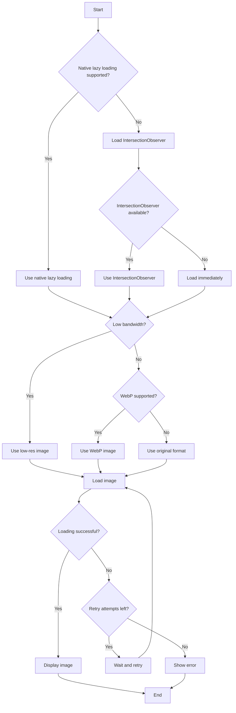

## Decision Tree

```mermaid
graph TD
    A[Start] --> B{Native lazy loading supported?}
    B -->|Yes| C[Use native lazy loading]
    B -->|No| D[Load IntersectionObserver]
    D --> E{IntersectionObserver available?}
    E -->|Yes| F[Use IntersectionObserver]
    E -->|No| G[Load immediately]
    C --> H{Low bandwidth?}
    F --> H
    G --> H
    H -->|Yes| I[Use low-res image]
    H -->|No| J{WebP supported?}
    I --> K[Load image]
    J -->|Yes| L[Use WebP image]
    J -->|No| M[Use original format]
    L --> K
    M --> K
    K --> N{Loading successful?}
    N -->|Yes| O[Display image]
    N -->|No| P{Retry attempts left?}
    P -->|Yes| Q[Wait and retry]
    P -->|No| R[Show error]
    Q --> K
    O --> S[End]
    R --> S
```
