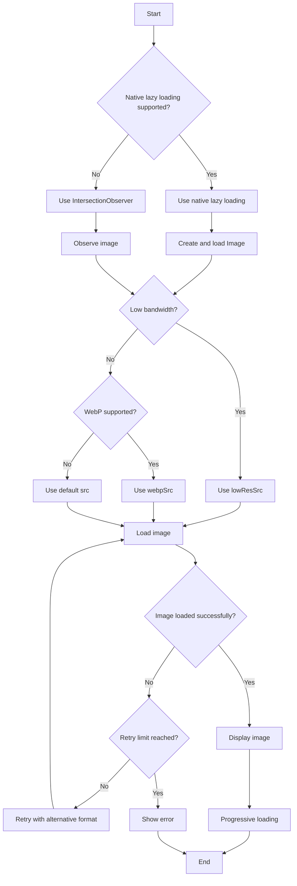

## Decision Tree

```mermaid
graph TD
    A[Start] --> B{Native lazy loading supported?}
    B -->|Yes| C[Use native lazy loading]
    B -->|No| D[Use IntersectionObserver]
    C --> E[Create and load Image]
    D --> F[Observe image]
    E --> G{Low bandwidth?}
    F --> G
    G -->|Yes| H[Use lowResSrc]
    G -->|No| I{WebP supported?}
    I -->|Yes| J[Use webpSrc]
    I -->|No| K[Use default src]
    H --> L[Load image]
    J --> L
    K --> L
    L --> M{Image loaded successfully?}
    M -->|Yes| N[Display image]
    M -->|No| O{Retry limit reached?}
    O -->|No| P[Retry with alternative format]
    O -->|Yes| Q[Show error]
    P --> L
    N --> R[Progressive loading]
    R --> S[End]
    Q --> S
```
