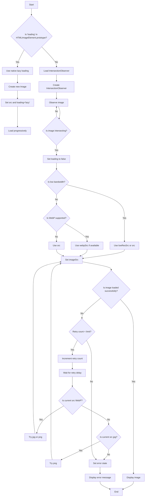

## Decision Tree

```mermaid
graph TD
    A[Start] --> B{Is 'loading' in HTMLImageElement.prototype?}
    B -->|Yes| C[Use native lazy loading]
    B -->|No| D[Load IntersectionObserver]
    C --> E[Create new Image]
    E --> F[Set src and loading='lazy']
    F --> G[Load progressively]
    D --> H[Create IntersectionObserver]
    H --> I[Observe image]
    I --> J{Is image intersecting?}
    J -->|Yes| K[Set loading to false]
    J -->|No| I
    K --> L{Is low bandwidth?}
    L -->|Yes| M[Use lowResSrc or src]
    L -->|No| N{Is WebP supported?}
    N -->|Yes| O[Use webpSrc if available]
    N -->|No| P[Use src]
    M --> Q[Set imageSrc]
    O --> Q
    P --> Q
    Q --> R{Is image loaded successfully?}
    R -->|Yes| S[Display image]
    R -->|No| T{Retry count < limit?}
    T -->|Yes| U[Increment retry count]
    U --> V[Wait for retry delay]
    V --> W{Is current src WebP?}
    W -->|Yes| X[Try jpg or png]
    W -->|No| Y{Is current src jpg?}
    Y -->|Yes| Z[Try png]
    Y -->|No| AA[Set error state]
    X --> Q
    Z --> Q
    T -->|No| AA
    AA --> AB[Display error message]
    S --> AC[End]
    AB --> AC
```
