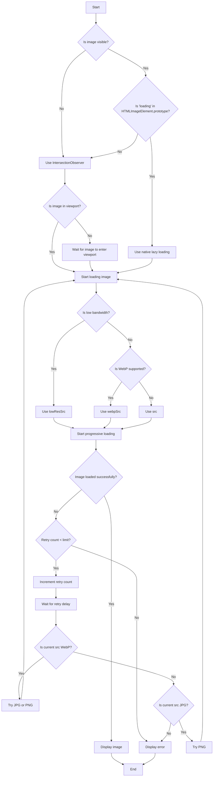

## Decision Tree

```mermaid
graph TD
    A[Start] --> B{Is image visible?}
    B -->|Yes| C{Is 'loading' in HTMLImageElement.prototype?}
    B -->|No| D[Use IntersectionObserver]
    C -->|Yes| E[Use native lazy loading]
    C -->|No| D
    D --> F{Is image in viewport?}
    F -->|Yes| G[Start loading image]
    F -->|No| H[Wait for image to enter viewport]
    H --> G
    E --> G
    G --> I{Is low bandwidth?}
    I -->|Yes| J[Use lowResSrc]
    I -->|No| K{Is WebP supported?}
    K -->|Yes| L[Use webpSrc]
    K -->|No| M[Use src]
    J --> N[Start progressive loading]
    L --> N
    M --> N
    N --> O{Image loaded successfully?}
    O -->|Yes| P[Display image]
    O -->|No| Q{Retry count < limit?}
    Q -->|Yes| R[Increment retry count]
    Q -->|No| S[Display error]
    R --> T[Wait for retry delay]
    T --> U{Is current src WebP?}
    U -->|Yes| V[Try JPG or PNG]
    U -->|No| W{Is current src JPG?}
    W -->|Yes| X[Try PNG]
    W -->|No| S
    V --> G
    X --> G
    P --> Y[End]
    S --> Y
```
