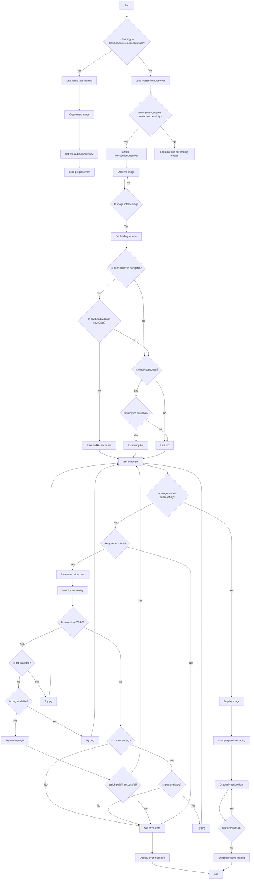

## Decision Tree

```mermaid
graph TD
    A[Start] --> B{Is 'loading' in HTMLImageElement.prototype?}
    B -->|Yes| C[Use native lazy loading]
    B -->|No| D[Load IntersectionObserver]
    C --> E[Create new Image]
    E --> F[Set src and loading='lazy']
    F --> G[Load progressively]
    D --> H{IntersectionObserver loaded successfully?}
    H -->|Yes| I[Create IntersectionObserver]
    H -->|No| J[Log error and set loading to false]
    I --> K[Observe image]
    K --> L{Is image intersecting?}
    L -->|Yes| M[Set loading to false]
    L -->|No| K
    M --> N{Is 'connection' in navigator?}
    N -->|Yes| O{Is low bandwidth or saveData?}
    N -->|No| P{Is WebP supported?}
    O -->|Yes| Q[Use lowResSrc or src]
    O -->|No| P
    P -->|Yes| R{Is webpSrc available?}
    P -->|No| S[Use src]
    R -->|Yes| T[Use webpSrc]
    R -->|No| S
    Q --> U[Set imageSrc]
    T --> U
    S --> U
    U --> V{Is image loaded successfully?}
    V -->|Yes| W[Display image]
    V -->|No| X{Retry count < limit?}
    X -->|Yes| Y[Increment retry count]
    Y --> Z[Wait for retry delay]
    Z --> AA{Is current src WebP?}
    AA -->|Yes| AB{Is jpg available?}
    AA -->|No| AC{Is current src jpg?}
    AB -->|Yes| AD[Try jpg]
    AB -->|No| AE{Is png available?}
    AE -->|Yes| AF[Try png]
    AE -->|No| AG[Try WebP polyfill]
    AC -->|Yes| AH{Is png available?}
    AC -->|No| AI[Set error state]
    AH -->|Yes| AJ[Try png]
    AH -->|No| AI
    AD --> U
    AF --> U
    AG --> AK{WebP polyfill successful?}
    AK -->|Yes| U
    AK -->|No| AI
    AJ --> U
    X -->|No| AI
    AI --> AL[Display error message]
    W --> AM[Start progressive loading]
    AM --> AN[Gradually reduce blur]
    AN --> AO{Blur amount > 0?}
    AO -->|Yes| AN
    AO -->|No| AP[End progressive loading]
    AL --> AQ[End]
    AP --> AQ
```
